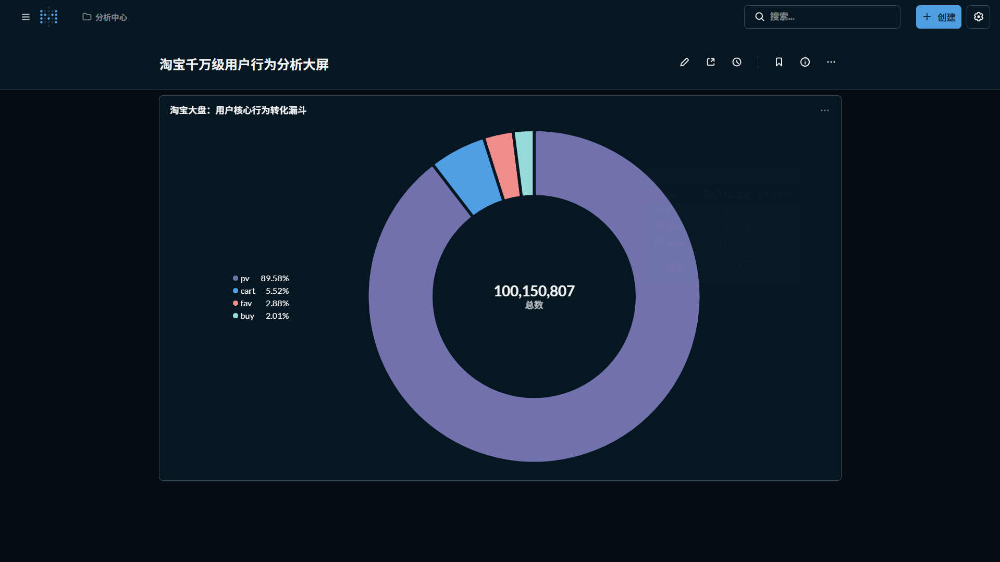

淘宝用户行为海量数据分析与 RFM 模型构建 (Data Pipeline)



📖 项目简介
本项目基于淘宝真实的亿级用户行为数据集（约 6.4GB），构建了一个端到端的企业级数据管道 (Data Pipeline)。项目涵盖了从基础设施容器化部署、海量数据分布式清洗、数仓分层建模，到核心业务指标 (RFM) 并行化计算与自动化工作流调度的全链路流程。

最终成功将庞杂的原始流水日志提炼为 33MB 的高价值用户特征数据，为下游的 BI 可视化大屏和精准营销策略提供了可靠的数据底座。

🛠️ 核心技术栈
计算引擎: PySpark (解决海量数据单机内存溢出问题)

工作流调度: Apache Airflow (DAG 定时调度与容错机制)

底层存储: PostgreSQL (数仓分层 ODS/ADS)

容器化与环境: Docker, Docker Compose, WSL2 (Ubuntu)

数据可视化: Metabase (敏捷 BI 看板构建)

⚙️ 架构设计与亮点 (Core Features)
1. 分布式数据处理与单机性能突破
面对 6.4GB 的海量原始数据，直接使用传统的 Python (Pandas) 会导致严重的内存溢出 (OOM)。本项目引入 PySpark 分布式计算框架：

使用 DataFrame API 进行高效的并行化数据清洗（去重、空值处理、时间戳转换）。

利用 Spark SQL 底层的 HashAggregation 实现了 RFM 核心指标（最近一次购买间隔 R、购买频次 F）的极速聚合计算。

2. 企业级工作流调度与容错 (Orchestration)
摒弃了传统的手动脚本执行，全面拥抱 Apache Airflow 进行任务编排：

编写 DAG 脚本实现每日凌晨 2 点的自动化定时调度 。

实现了企业级的容错机制，配置了任务失败后的自动重试链路 (retries: 3, retry_delay: 5m)。

3. 计算与调度环境解耦 (架构思考)
遵循现代数据工程的最佳实践，在容器化部署时实现了“调度节点”与“计算节点”的物理隔离。Airflow 容器仅作为触发器与状态机，不承载庞大的 Spark 运行环境，避免了调度集群的臃肿，完美契合生产环境中通过 SparkSubmitOperator 向 YARN/K8s 集群提交任务的微服务架构思想。

4. 规范化的数仓建模
在 PostgreSQL 中实践了经典的数据仓库分层理论：

ODS 层 (Operational Data Store): 贴源层，全量对接并保留 6.4GB 原始用户行为流水。

ADS 层 (Application Data Service): 应用层，沉淀经过 PySpark 分布式计算产出的 ads_user_rfm_pyspark 结果表，直接服务于 BI 层。

📂 项目目录结构
Plaintext
```
📁 taobao_project/
├── 📂 airflow/
│   └── 📂 dags/
│       ├── 📜 pyspark_rfm_etl.py  # PySpark 分布式数据处理与计算核心逻辑
│       └── 📜 taobao_rfm_dag.py   # Airflow DAG 自动化调度工作流配置
├── 🐳 docker-compose.yaml         # 整体微型架构容器化部署文件
└── 🚀 README.md                  # 快速启动 (Quick Start))
```
1. 启动底层基础设施
确保已安装 Docker Desktop 并开启 WSL2 后端，在终端执行以下命令拉起所有组件：

Bash
cd taobao_project/airflow
docker-compose up -d


2. 运行分布式计算管道
进入 WSL 终端，直接执行 PySpark 脚本，触发 ODS 到 ADS 的数据流转与 RFM 计算：

Bash
python3 ~/taobao_project/airflow/dags/pyspark_rfm_etl.py


3. 访问 Airflow 调度平台
浏览器访问 http://localhost:8080，开启 taobao_pyspark_rfm_dag 的日常自动化调度。

